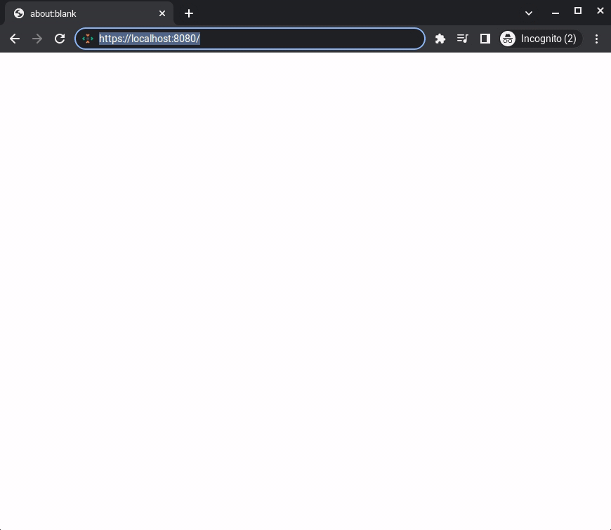
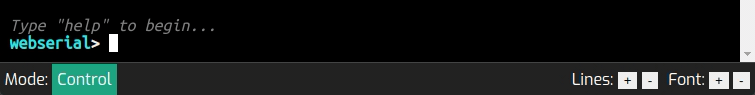
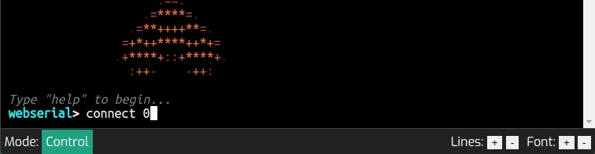
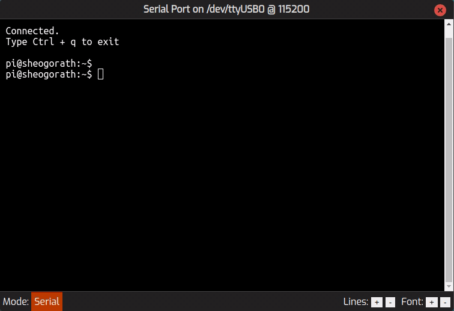
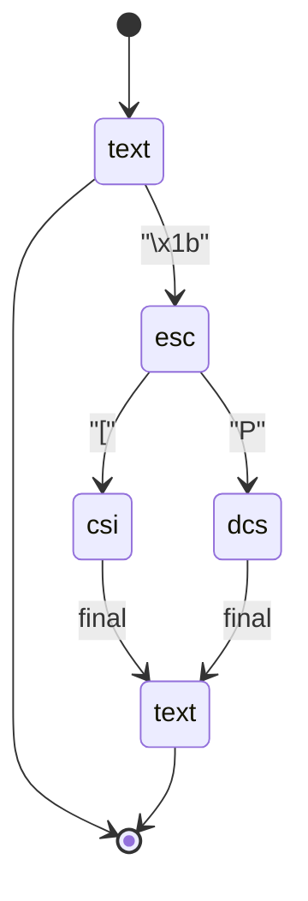

# Web Serial Multiplexer

This project is designed to provide a web based serial multiplexer using cheap
and easily available USB serial adaptors.

Internally, we manage a small number of devices over serial, and found that our
older dedicated serial hardware didn't work as expected. We don't need a fancy
interface, and  neither support lots of users.

Support for this product will be best-effort; feature requests and bug reports
will be handled as and when they can. For significant features or support,
please contact support at aps-networks.com.


## Features:

* Command line as the primary interface
* Optional SSL encryption
* Multiple concurrent sessions
* Rudimentary session management
* Digest authentication (see security advisory)
* Setting of baud rate, parity, stop bits and character size
* ANSI escape code passthrough
* X-Clacks-Overhead compliant web server


## Short Demo




## Security Advisory

This software is not designed to be run in non-secure environments. While some
effort has been undertaken to prevent the transmission of text and passwords in
the clear, the current authentication method uses MD5 digests which is generally
accepted as being out of date and inherently insecure. See known issues for
further information.


## Requirements

* `npm`
* A C++23 compatible compiler.
* CMake 3.16 or higher

Additionally, the user running the application will require access to serial
ports, either by being a super-user, or being a member of the `dialout` group.

Boost and other C++ dependencies are downloaded as a part of the build.

> Note: This will not compile on gcc-11; please use gcc-12 or later.


## Building

This project is built using CMake. Assuming the current working directory is
the projects root:

```bash
# Assuming in project's top level dir
mkdir build
cd build
cmake ..
make npm_build webserial_main wspasswd
```

The most interesting top-level targets are:

| Target           | Description                                                                         |
|------------------|-------------------------------------------------------------------------------------|
| `npm_build`      | Builds the website. Output directory is at `site/dist`.                             |
| `webserial_main` | Builds the `webserial` executable and dependencies. Output is `build/bin/webserial` |
| `wspasswd`       | Builds the `wspasswd` tool. Output is `build/bin/webserial`                         |
| `cert_create`    | Creates a CA key and signed server certificate. Output is in `scrpts`               |


## Usage

First of all, a password file needs to be created; this is an MD5 sum of the
desired user and password. The format is the HA1 format used in the HTTP message
digest algorithm. This is done via the `wspasswd` application in the `bin`
directory. Please see both the security advisory and known issues sections for
drawbacks of this approach.

```bash
# Assuming within CMake build directory
./bin/wspasswd --user admin --pass pass --out passwd.txt
```  


The application that runs the server is called `webserial`, the options for
which are as follows:

| Argument      | Required | Default   | Description                                               |
|---------------|----------|-----------|-----------------------------------------------------------|
| `--host`      | no       | `0.0.0.0` | IP address on which to serve website.                     |
| `--port`      | no       | `8080`    | Port on which to serve website.                           |
| `--root`      | yes      | none      | Path to directory containing static website content.      |
| `--pass-file` | yes      | none      | Path to password file.                                    |
| `--cert-path` | no*      | none      | Path to PEM encoded SSL certificate.                      |
| `--key-path`  | no*      | none      | Path to certificate's private key.                        |
| `--dh-path`   | no*      | none      | Diffie-Hellman SSL parameters.                            |
| `--log-level` | no       | `info`    | One of `trace`, `debug`, `info`, `warn`, `error`, `fatal` |

> **\*** Required together 


Therefore, the minimal invocation is:

```bash
./bin/webserial --pass-file ./passwd.txt --root ../site/dist
```

This starts the server with no SSL and the default log level.

For adding SSL support, a certificate, private key and Diffie-Hellman
parameters must be provided, for example:

```bash
./bin/webserial \
      --cert-path ../scripts/serial.apsn.local.crt \
      --key-path  ../scripts/serial.apsn.local.key.pem \
      --dh-path   ../scripts/serial.apsn.local.dh.pem \
      --pass-file ./passwd.txt \
      --root      ../site/dist
```

> **Note:** The keys provided here were created via a generator script in the
> `scripts` directory. See the relevant appendix on it's operation.


After authentication, you will immediately be presented with a terminal console
connected to a control CLI. This enables you to list, connect to, and set
parameters for ports; list, view and kill other connected sessions, and finally
refresh available serial devices.

```
Type "help" to begin...
webserial>
```

Some operations are grouped into submenus. To access these, type the name of 
the menu. To exit a sub menu, type the name of the root menu, or press
`Ctrl + c`.


```
webserial> help
Commands available:
 - help
        This help message
 - list
        List available ports
 - connect <unsigned long>
        Connect to a port
 - test
        (menu)
 - session
        (menu)
 - system
        (menu)
 - ports
        (menu)
```


### Configure Serial Ports

This is done via the `ports` menu. The following commands are available:

| Command              | Description                                              |
|----------------------|----------------------------------------------------------|
| `help`               | Displays help. No arguments.                             |
| `list`               | Displays available ports and their status. No arguments. |
| `set_speed`          | Accepts: `integer` port id, `integer` baud rate.  | 
| `set_parity`         | Accepts: `integer` port id, one of `string`: "none", "off", "odd", "even" |
| `set_character_size` | Accepts: `integer` port id.                                    |
| `set_stop_bits`      | Accepts: `integer` port id, one of `string`: "1", "1.5", "2"  |
| `webserial`          | None                                                 |

> Flow control is not implemented at this time.

On startup, the current TTY settings are retrieved from the operating system.
However, these may not reflect what's required. For example, the test port
and device runs at 115200 baud, however on a system reset, this defaults to
2400 baud.

The configuration options are not applied immediately to the port, they are
only applied when a new serial port session is established. 

The settings themselves will not be persisted by the application, however,
typically the `termios` system will preserve whatever settings have been
applied by Boost.Asio.

Expect the settings to completely reset on system reset.


### Connecting to a Port

At the root `webserial` menu, simply type connect, followed by the port ID.
This can be found by using the `list` command in the same menu context.

On success, the terminal window will indicate the `serial` mode in the bottom
left hand corner.

If a port is in use, then the conect attempt will fail, with an error message
indicating as such.




### Managing Sessions

Since multiple sessions* can be maintained at the same time, sometimes it is
necessary to relieve another session of it's currently connected port. You can
list and kill sessions via the `session` sub menu, the commands for which are:

| Command     | Description           |
|-------------|-----------------------|
| `help`      | This help message     |
| `list`      | List current sessions |
| `kill`      | Kill a session        |
| `webserial` | (menu)                |



The connected user will experience a disconnection:



> **\*** For the _single_ user. In the future, multiple users combined with 
> user or administrative roles would prevent an ordinary user from terminating
> another session wantonly.


## General Operation

The application uses Boost.Beast to listen for incoming connections. Valid
requests are either passed to a request handler, or, if it is a websocket
upgrade, passed to a websocket handler.

The current HTTP handler is a "router" which accepts sub-handlers for specific
routes, which could be for serving files, JSON or custom responses. Routes are
matched first by method and then by the request target, via Longest-Prefix Match
(which leads to some wierdness: see known issues). Handlers can be encapsulated
by middleware, for which currently an 
[NCSA](https://en.wikipedia.org/wiki/Common_Log_Format)-style log formatter and
a simple implementation of message digest authentication is used. Middleware
can operate on just the HTTP header, before the body is read, or, the entire
message. This is so that things like setting a large body size limit when
a user is authenticated can be done.

Currently pages and assets do not require a digest, but the websocket does.

The websocket handler is designed to accept connections from the attached
XTerm.js application; on a succesful connection, input and output is directed
to one of two states. The first of these being a `control` state which you can
use to connect to a port. The second of these is the `serial` state which
"simply" redirects input and output to a Boost.Asio serial port. The base class
contains a rudimentary state machine for handling ANSI escape codes:



The serial state passes on all `CSI` codes, and ignores `APC` and `DCS` codes.
The control state implements some cursor codes for history navigation, 


> **Summary of Control Codes used By `webserial`**
>
> See Wikipedia further information on [ANSI codes](https://en.wikipedia.org/wiki/ANSI_escape_code).
>
> | Name  | Description                                                              |
> |-------|--------------------------------------------------------------------------|
> | `APC` | Application Program Command. Not in wide use. Candidate for co-option by webserial for some use |
> | `C0`  | Single character codes. Backspace, line feed, form feed etc.             |
> | `CSI` | Command Sequence Introducer. Colours, positioning, editing.              |
> | `DCS` | Device Control Sequence. Currently processed but not handled.            |
> | `OSC` | Operating System Command. Used by webserial to set XTerm.js window title |


## Logging Out

Simply click on the red X in the top-right corner of the window. This will 
send an unauthorised HTTP message, which should clear the browser's 
authentication header. 


## Known Issues / Deficiencies

* Lack of tab completions when in the control state
* Use of digest authentication, and at that, the weakest implementation (no use
  of QoP or nonce counter). Ultimately, this was done to prevent the password 
  from being stored on the host system in plain text, or passed in as a plain 
  text command-line parameter, to the detriment of the overall security of the
  application. Ultimately, the ideal scenario would be the use of a user
  database using bcrypt hashes. However this would involve using session based
  authentication which would require a non-trivial amount of work. There is a
  slight upside; if SSL is not used, it at the very least prevents HTTP
  athentication from happening _completely_ in the clear.
* The HTTP router uses LPM matching for prefix based routes, which leads to
  eager rejections. For example, a file at `/loggedout.html` would initially 
  match on the exact `/logout` route, but since the request target and the
  match target are not exactly the same, the request would be rejected. 
* The server does no filtering on serial ports; if a serial port is visible to
  the user running the application, it will be available,
* Websocket handlers do not support middleware. This would be useful as the 
  upgrade request is made via HTTP, and as such, will still have headers that
  can be parsed, e.g., authentication or authorisation tokens.
* It was observed on one occasion that a session existed without it being
  registered at that time. It's not clear if this was a failure to register,
  or that it was unregistered early. The impact of this is that if the session
  held a port, it couldn't be killed by another.
* Neither the HTTP or webserial libraries are well documented.

## Potential Features

The following features are not currently implemented, but we may do so if there
is demand:

* Optional DH parameters (i.e., they are only optionally required)
* Basic athentication
* Session authentication
* User database
* Role based access control
* Direct access to port through link
* Handlers can be added to provide a more traditional JSON style API, as 
  opposed to all the operations (i.e., listing ports) happening through the
  control state
* True port configuration persistence
* Installer package


## Appendices

### SSL Certificate Script

For testing SSL operation (and removing certificate errors for screen captures),
a script has been developed that creates both Certificate Authority and server
certificates & private keys. This is located at `scripts/generate_keys.sh`.

If the CA keys already exist, these will not be re-created. This is so that the
Certificate Authority does not need to be imported into a browser every time a
new server certificate is generated. The same is true of the Diffie-Hellman
parameters, however this is simply because they can take a short while to 
create.

Server certificates are regenerated at every invocation.

The certificate settings are contained within `scripts/cert_config.json`. By
default, the subject is based on `apsn.local` addresses. This is not 
representative of any of our infrastructure and is used for testing only.


### VSCode Settings

The `.vscode` folder contains a launch configuration and various tasks for
debugging. Launching the debug configuration will:
* Build `wspasswd` and generate a password file containing the MD5 HA1 tuple of
 `admin:webserial:pass` 
* Generate the test certificates
* Build the Javascript website bundle
* Download and build dependencies
* Build `webserial` with debug symbols on
* Launch `webserial` with the generated certificate and password file


### Acknowledgements

* MD5 implementation derived from the RSA Data Security, Inc. MD5 Message-Digest
  Algorithm. Converted to C++ by [Frank Thilo](http://www.zedwood.com/article/cpp-md5-function).
* Doxygen CSS theme modified from [doxygen-awesome-css](https://github.com/jothepro/doxygen-awesome-css)
* Serial API provided by [Boost.Asio](https://www.boost.org/doc/libs/1_81_0/doc/html/boost_asio.html)
* Async HTTP based on [Boost.Beast](https://www.boost.org/doc/libs/1_81_0/libs/beast/doc/html/index.html).
  Listener, handler and middleware class are based, in part, on the Beast 
  provided examples.
* CLI control session uses a modified version of [daniell77/cli](https://github.com/daniele77/cli)
* String formatting provided by [fmt::fmt](https://github.com/fmtlib/fmt)
* JSON support written using [nlohmann/json](https://github.com/nlohmann/json)
* Browser console provided by [XTerm.js](http://xtermjs.org/)
* Main font is [Exo 2](https://fonts.google.com/specimen/Exo+2), terminal font
  is [Ubuntu Mono](https://fonts.google.com/specimen/Ubuntu+Mono), both from
  Google Fonts
* SVG icons from [SVG repo](https://www.svgrepo.com/).
* Bell chime is [Melancholy UI Chime](https://pixabay.com/sound-effects/melancholy-ui-chime-47804/)
  from Pixabay.
* Japanese text for demonstrating unicode support was generated by 
  [lorem-ipsum.info](https://generator.lorem-ipsum.info/_japanese)
